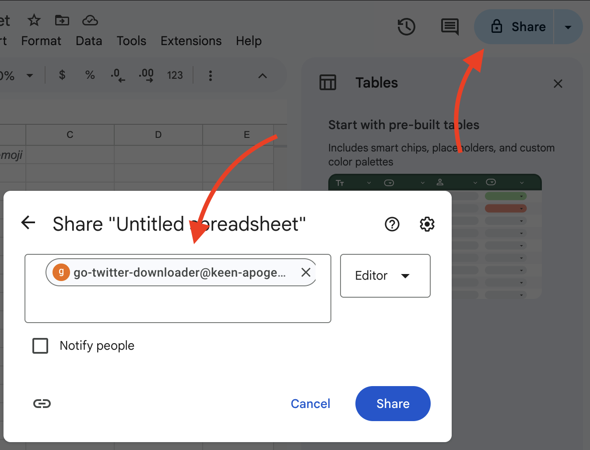
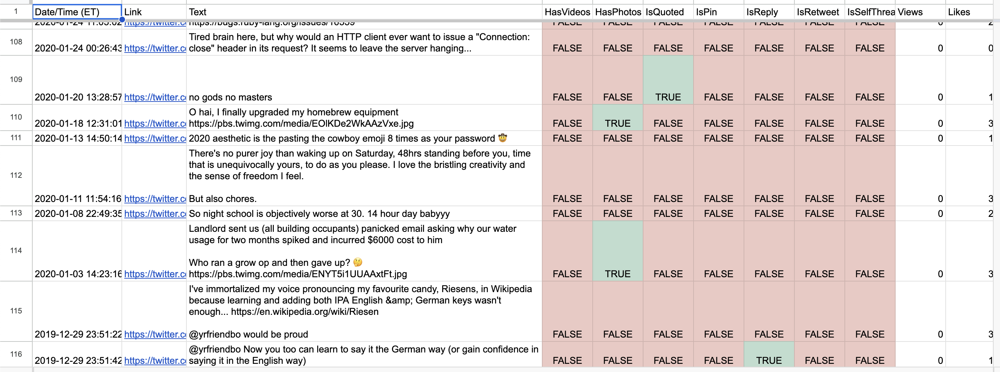

# 🐦⬇️ go-twitter-downloader ⬇️🐦
### 📊⬆️ ...and uploader to Google Sheets ⬆️📊

A simple CLI tool for scraping all the Twitter tweets/X posts for a given account and (optionally) uploading them into Google Sheets.

## Install

```zsh
git clone https://github.com/f3ndot/go-twitter-downloader
cd go-twitter-downloader/
go build
```

### Get your twitter credentials (Required)

Login to Twitter/X on your fav browser, open Dev Tools, and copy all of your cookies for Twitter/X into `./cookies.json`. It should look like so:

```json
{
    "auth_token": "3aef8...",
    "ct0": "c32abe61..",
    "guest_id": "v1:17386...",
    "guest_id_ads": "v1:1738...",
    "guest_id_marketing": "v1:17386...",
    "kdt": "6BqWxPD...",
    "night_mode": "2",
    "personalization_id": "\"v1_Awzw...=\"",
    "twid": "u=155..."
}
```

Right now only `auth_token` and `ct0` are required.

### Get your Google credentials (Optional)

You need to have a Google  service account in order to upload to a Google Sheet.

Go to [Google Cloud Console](https://console.cloud.google.com) and:

1. Create a project
2. Enable the Google Sheets API
3. Create a service account. Note its "email" in the format of `<service-account-name>@<your-project-id>.iam.gserviceaccount.com`
4. Add and download a key for the service account (.json format)
5. Save it as `./service_account.json`

## Usage

```zsh                                                                                                                                                  ─╯
Usage: ./twitter-downloader [options] <username>
Options:
  -number int
    	Max number of tweets to download (default 3200)
  -output string
    	Where the tweets should be saved (default "<username>.json")
  -retweets
    	Include retweets/RTs in download
  -spreadsheet-id string
    	The Google Sheet ID to upload results to
  -verbose
    	Enable verbose mode
```

#### Example

```json
{
  "tweets": [
    {
      "ConversationID": "1672263841118339078",
      "GIFs": null,
      "Hashtags": null,
      "HTML": "\u003ca href=\"https://twitter.com/talkytoaster\"\u003e@talkytoaster\u003c/a\u003e new to this world of loading OSM or TT maps onto a dedicated Garmin Edge Touring device. Which of your maps (if at all) are acceptable for long inter-city bicycle touring in Scotland? Looking for a good map to pair with turn-by-turn directions of a pre-made route",
      "ID": "1672263841118339078",
      "InReplyToStatus": null,
      "InReplyToStatusID": "",
      "IsQuoted": false,
      "IsPin": false,
      "IsReply": false,
      "IsRetweet": false,
      "IsSelfThread": false,
      "Likes": 0,
      "Name": "Justin Bull",
      "Mentions": [
        {
          "ID": "16331381",
          "Username": "talkytoaster",
          "Name": "Martin Overton"
        }
      ],
      "PermanentURL": "https://twitter.com/f3ndot/status/1672263841118339078",
      "Photos": null,
      "Place": null,
      "QuotedStatus": null,
      "QuotedStatusID": "",
      "Replies": 2,
      "Retweets": 0,
      "RetweetedStatus": null,
      "RetweetedStatusID": "",
      "Text": "@talkytoaster new to this world of loading OSM or TT maps onto a dedicated Garmin Edge Touring device. Which of your maps (if at all) are acceptable for long inter-city bicycle touring in Scotland? Looking for a good map to pair with turn-by-turn directions of a pre-made route",
      "Thread": null,
      "TimeParsed": "2023-06-23T15:22:23Z",
      "Timestamp": 1687533743,
      "URLs": null,
      "UserID": "15592960",
      "Username": "f3ndot",
      "Videos": null,
      "Views": 158,
      "SensitiveContent": false
    },
    {
      "ConversationID": "1672263841118339078",
      "GIFs": null,
      "Hashtags": null,
      "HTML": "\u003ca href=\"https://twitter.com/talkytoaster\"\u003e@talkytoaster\u003c/a\u003e ended up getting your TT STD for British Isles. So far it looks great with my pre-made .fit route from RideWithGPS. Far better countours/details zoomed out \u0026gt;3km than official Garmin Cyclist Europe map I paid for. Thanks for the maps!",
      "ID": "1672272696971853826",
      "InReplyToStatus": null,
      "InReplyToStatusID": "1672263841118339078",
      "IsQuoted": false,
      "IsPin": false,
      "IsReply": true,
      "IsRetweet": false,
      "IsSelfThread": false,
      "Likes": 0,
      "Name": "Justin Bull",
      "Mentions": [
        {
          "ID": "16331381",
          "Username": "talkytoaster",
          "Name": "Martin Overton"
        }
      ],
      "PermanentURL": "https://twitter.com/f3ndot/status/1672272696971853826",
      "Photos": null,
      "Place": null,
      "QuotedStatus": null,
      "QuotedStatusID": "",
      "Replies": 0,
      "Retweets": 0,
      "RetweetedStatus": null,
      "RetweetedStatusID": "",
      "Text": "@talkytoaster ended up getting your TT STD for British Isles. So far it looks great with my pre-made .fit route from RideWithGPS. Far better countours/details zoomed out \u0026gt;3km than official Garmin Cyclist Europe map I paid for. Thanks for the maps!",
      "Thread": null,
      "TimeParsed": "2023-06-23T15:57:34Z",
      "Timestamp": 1687535854,
      "URLs": null,
      "UserID": "15592960",
      "Username": "f3ndot",
      "Videos": null,
      "Views": 142,
      "SensitiveContent": false
    },
    {
      "ConversationID": "1626044729254199296",
      "GIFs": null,
      "Hashtags": null,
      "HTML": "99% sure I just heard a fart on a hot mic during the Toronto City Council budget live stream. \u003ca href=\"https://twitter.com/GraphicMatt\"\u003e@GraphicMatt\u003c/a\u003e did you get that?",
      "ID": "1626044729254199296",
      "InReplyToStatus": null,
      "InReplyToStatusID": "",
      "IsQuoted": false,
      "IsPin": false,
      "IsReply": false,
      "IsRetweet": false,
      "IsSelfThread": false,
      "Likes": 0,
      "Name": "Justin Bull",
      "Mentions": [
        {
          "ID": "1956441",
          "Username": "GraphicMatt",
          "Name": "Matt Elliott"
        }
      ],
      "PermanentURL": "https://twitter.com/f3ndot/status/1626044729254199296",
      "Photos": null,
      "Place": null,
      "QuotedStatus": null,
      "QuotedStatusID": "",
      "Replies": 1,
      "Retweets": 0,
      "RetweetedStatus": null,
      "RetweetedStatusID": "",
      "Text": "99% sure I just heard a fart on a hot mic during the Toronto City Council budget live stream. @GraphicMatt did you get that?",
      "Thread": null,
      "TimeParsed": "2023-02-16T02:24:08Z",
      "Timestamp": 1676514248,
      "URLs": null,
      "UserID": "15592960",
      "Username": "f3ndot",
      "Videos": null,
      "Views": 260,
      "SensitiveContent": false
    }
  ]
}
```

### Google Sheets

In order for uploading to Google sheets, you first need to:

1. Create the Spreadsheet first, to get the ID
2. Share the document the Google Service Account via its email



Then use like so:

```zsh
./twitter-downloader -spreadsheed-id 6SUpsNE1Na0E0B1vCxCooKEm8Um9 f3ndot
```

#### Example



## TODO:

* [ ] Incorporate media downloading
* [ ] Don't purge deleted tweets aka UPSERT logic